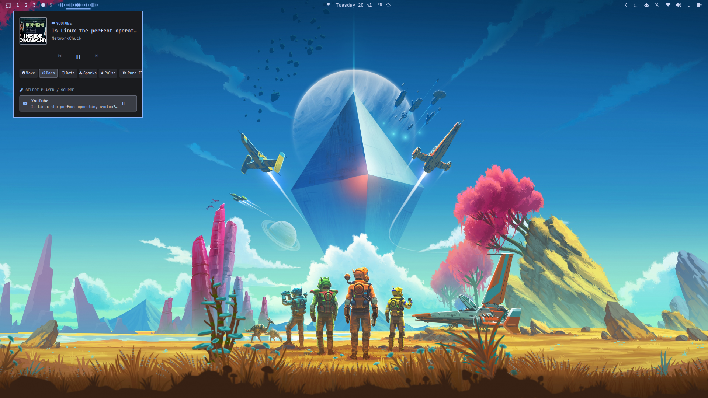
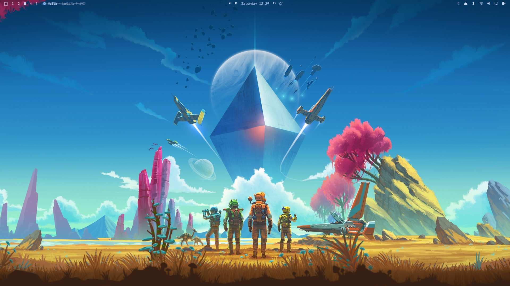
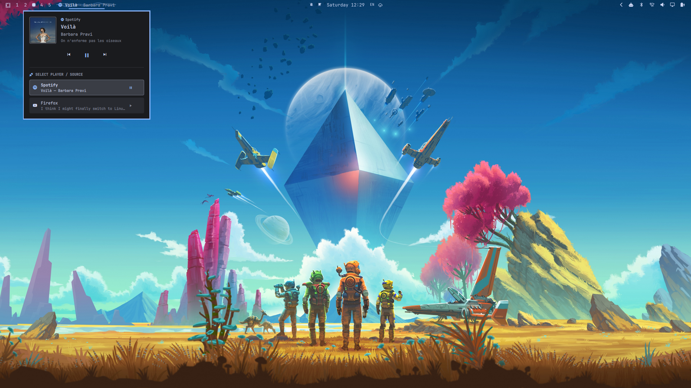

# 🌊 Omarchy Music Flow

A sleek, ricer-styled **Music Flow** widget and floating **Media Controller** for [Omarchy Linux](https://omarchy.org/) (Quickshell / Hyprland).

Featuring a smooth, borderless **dual-harmonic sound wave visualizer** on your status bar and a **dedicated floating Player & Multi-Source Selector** window.

---

## 📸 Screenshots

### 🎛️ Live Setup & Multi-Flow Mode Switcher
*Full desktop showcase: Bar visualizer in Pure Flow mode alongside the floating player panel, 6-mode visualizer switcher, and YouTube source detection.*


### 🎵 Status Bar Soundwave Flow
*Seamless, borderless audio wave flow with marquee song title and artist on the top bar.*


### 🎛️ Floating Player & Multi-Source Selector Panel
*Dedicated floating media window with album artwork, playback deck, and one-click source switching (Spotify, Zen / Firefox / Chrome, MPV, etc.).*


---

## ✨ Features

- 🎵 **Pure Soundwave Visualizer Flow**: Dual-layer harmonic wave oscillating horizontally across the status bar in real-time with your theme's accent color whenever audio is active.
- 🌐 **Universal Browser & Web Audio Support**: Fully picks up audio from **Zen Browser**, **Firefox**, **Brave**, **Google Chrome**, **Chromium**, and web services (**YouTube**, **SoundCloud**, **Twitch**, **Bandcamp**, **Netflix**, HTML5 media, and WebAudio).
- 🌸 **Native Seanime & Anime Video Support**: Seamlessly tracks **Seanime** (both Desktop App and Web player), **MPV**, **VLC**, and **Celluloid** with automatic anime filename & tag cleaning (`[SubsPlease]`, `(1080p)`, etc.).
- 🔊 **PipeWire Direct Stream Detection**: Automatically captures active audio streams even if an application does not natively implement MPRIS D-Bus.
- 🎨 **Minimalist & Borderless**: Clean, transparent integration that seamlessly blends with your top bar without visual clutter.
- 📜 **Smooth Marquee Scroll**: Track title and artist (`Title · Artist`) with initial pause and smooth scrolling when names are long.
- 🎛️ **Dedicated Floating Media Player Panel**:
  - High-resolution album artwork preview / source badge.
  - Track metadata (Title, Artist, Album, Source).
  - Comfortable playback controls (**Previous**, **Play / Pause**, **Next**).
  - **Multi-Source Selector (`󱘖 SELECT PLAYER / SOURCE`)**: Instantly switch between running players with one click.
- 🗕 **Minimizable Compact Mode**: Collapses smoothly into a clean standalone status bar icon (**`󰝚`**) matching the battery and speaker widgets.
- 🖱️ **Intuitive Gestures**:
  - **Left-Click**: Open/close the dedicated floating Player & Source Selector window.
  - **Middle-Click**: Toggle Play / Pause.
  - **Scroll Wheel**: Scroll up/down over the widget to skip backward/forward tracks.

---

## 🚀 Installation

### Option 1: Native Omarchy Plugin Command (Recommended)

Install directly with the Omarchy CLI in a single command:

```bash
omarchy plugin add https://github.com/Clifford-Baidoo/omarchy-music-flow.git --enable
```

### Option 2: Clone & Run Installer

```bash
git clone https://github.com/Clifford-Baidoo/omarchy-music-flow.git
cd omarchy-music-flow
chmod +x install.sh update.sh uninstall.sh
./install.sh
```

The installer will:
1. Copy the plugin files to `~/.config/omarchy/plugins/custom.media/`.
2. Automatically enable MPV MPRIS integration for video & media playback.
3. Automatically configure your bar layout in `~/.config/omarchy/shell.json`.
4. Restart `omarchy-shell` to apply changes instantly.

---

## 🔄 Updating

### Option 1: Native Omarchy CLI (Recommended)

```bash
omarchy plugin update custom.media
```

### Option 2: Synchronize Local Files

```bash
cd omarchy-music-flow
./update.sh
```

The updater script will:
1. Synchronize all plugin files to `~/.config/omarchy/plugins/custom.media/`.
2. Clean up any deprecated legacy plugin directories.
3. Validate plugin schema and verify bar layout.
4. Reload `omarchy-shell` with the updated features and fixes.

---

## 🗑️ Uninstallation

To remove Music Flow and restore the default media widget:

```bash
cd omarchy-music-flow
./uninstall.sh
```

---

## 🕹️ Controls & Shortcuts

| Action | Bar Widget Gesture | Floating Player Window |
| :--- | :--- | :--- |
| **Open / Close Panel** | `Left-Click` | `Click Outside` / `ESC` |
| **Toggle Visualizer Text** | `Right-Click` | Flow Mode Row / Text Toggle |
| **Play / Pause** | `Middle-Click` | Center Button (`󰏤` / `󰐊`) |
| **Next Track** | `Scroll Down` | Forward Button (`󰒭`) |
| **Previous Track** | `Scroll Up` | Back Button (`󰒮`) |
| **Switch Player / Source** | Via Floating Panel | Click any player card in list |

---

## 📂 File Structure

```
omarchy-music-flow/
├── assets/
│   ├── bar-flow.png      # Screenshot of bar visualizer flow
│   └── player-panel.png  # Screenshot of floating player & source switcher
├── BarWidget.qml         # Status bar music flow & floating PopupCard panel
├── Service.qml           # MPRIS audio service & multi-source coordinator
├── MediaModel.js         # DBus player detection & metadata formatting
├── manifest.json         # Omarchy shell plugin manifest
├── install.sh            # Automated installer script
├── update.sh             # Automated updater script
├── uninstall.sh          # Automated uninstaller script
└── README.md             # Documentation & screenshots
```

---

## 🛠️ Requirements

- [Omarchy](https://omarchy.org/) (Arch Linux + Hyprland + Quickshell)
- PipeWire / WirePlumber
- Any media source (Spotify, Cider, Zen, Firefox, Chrome, Brave, Seanime, MPV, cliamp, VLC, etc.)

---

## 📄 License

MIT License. Feel free to use, modify, and rice to your heart's content!
